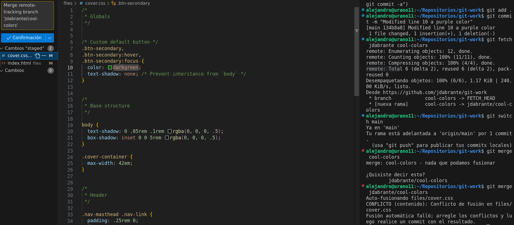

<div align="center">

# Documentación y sistema de control de versiones
***Alejandro Hdez:***
***Curso:*** 2º de Ciclo Superior de Desarrollo de Aplicaciones Web.

</div>

<div align="justify">

### ÍNDICE

+ [Introducción](#id1)
+ [Objetivos](#id2)
+ [Material empleado](#id3)
+ [Desarrollo](#id4)
+ [Conclusiones](#id5)


#### ***Introducción***. <a name="id1"></a>

En este documento se realiza una simulacón de trabajo usando control de versiones, en este caso particular, haciendo uso de Git y GitHub.

La práctica se realiza en parejas, haciendo los roles de "User1" y "User2" respectivamente. En este caso, esta práctica refleja el trabajo del "User1".

#### ***Objetivos***. <a name="id2"></a>

El objetvio de este práctica consiste en aprender los pasos a seguir entre dos usuarios que trabajen en el mismo proyecto, y que gracias al control de versiones, no existan conflictos entre el trabajo de un usuario y otro respectivamente.

#### ***Material empleado***. <a name="id3"></a>

El material empleado en la práctica por la parte de software ha consistido en: Visual Studio Code, uso de términal con Git, y GitHub, y la máquina y su configuración ya implementada en el equipo.

Por la parte del hardware se hace uso del equipo del aula 109 número 18.

#### ***Desarrollo***. <a name="id4"></a>

1. El alumnado trabajará por parejas: user1 y user2. Indicar quién es user1 y quién es user2.
- En dicha práctica el compañero Dimas Abrante hará el rol de user2 y Alejandro Hdez el rol de user1.
2. user1 creará un repositorio público llamado git-work en su cuenta de GitHub, añadiendo un README.md y una licencia MIT.
- Creamos el repositorio, público con lincencia, y su estructura de carpetas y documentación:

<div align="center">

  

</div>

3. user1 clonará el repo y añadirá los ficheros: index.html, bootstrap.min.css y cover.css. Luego subirá los cambios al upstream.
- Clonamos el repositorio usando el https y el comando "git clone":

  <div align="center">

  

</div>

4. user2 creará un fork de git-work desde su cuenta de GitHub.
- Se realiza un fork por medio de la opción que nos brinda el propio Github.

<div align="center">

  

</div>
<div align="center">

  

</div>

5. user2 clonará su fork del repo.
- Una vez "forkeado" el repositorio podrá ser clonado, en nuestro caso, por medio de SSH. Para ello se usará el comando: 

      git clone <url>

<div align="center">

  

</div>
<div align="center">

  

</div>
<div align="center">

  

</div>
<div align="center">

  

</div>

6. user1 creará una issue con el título "Add custom text for startup contents".
- Se crea el issue con el título marcado en la tarea.
<div align="center">

  

</div>

7. user2 creará una nueva rama custom-text y modificará el fichero index.html personalizándolo para una supuesta startup.
- Se crea la rama custom-text. Esto evitará los conflictos entre las nuevas funcionalidades o cambios que estemos realizando y los posibles cambios que podrían surgir en la rama de trabajo prinicpal del proyecto.
El comando a utilizar es: 

      git branch <nombre-rama>
      git switch <rama>

<div align="center">

  

</div>
<div align="center">

  

</div>

8. user2 enviará un PR a user1.
- Una vez hecho los cambios en la rama, estos se subiran. Para ello es necesario especificar la rama, ya que esta no se encuentra en el repositorio remoto. Terminado el push, se podrá solicitar un pull request al usuario del cual hemos forkeado el repositorio

<div align="center">

  

</div>


9. user1 probará el PR de user2 en su máquina (copia local) creando previamente un remoto denominado upstream, y realizará ciertos cambios en su copia local que luego deberá subir al propio PR.
- Comprobamos los remotos activos del repositorio, en este caso ya contabamos con que no hubieran dado que se creo el repositorio desde vacío, aún así hacemos uso del comando para practicar.
- Procedemos a añadir el remoto del compañero, en este caso el user2, y seguidamente iremos añadiendo, comiteando y subiedno a dicho remoto todos los cambios que se pide.
  
<div align="center">

  

</div>

<div align="center">

  

</div>

<div align="center">

  

</div>

<div align="center">

  

</div>

10. user1 y user2 tendrán una pequeña conversación en la página del PR, donde cada usuario incluirá, al menos, un cambio más.
- Se comentan los cambios pertinentes de cada usuario.

<div align="center">

  

</div>

11. user1 finalmente aprobará el PR, cerrará la issue creada (usando una referencia a la misma) y actualizará la rama principal en su copia local.

- Se cierra el PR habiendo realizado ambos cambios por parte de los dos usuarios.

<div align="center">

  

</div>

- Se actualiza la rama pirncipal en la copia local del user1.

<div align="center">

  

</div>
<div align="center">

  

</div>
<div align="center">

  

</div>

12. user2 deberá incorporar los cambios de la rama principal de upstream en su propia rama principal.
- Una vez el user1 (Alejandro) ha terminado los cambios, será necesario bajar estos nuevamente a local y además se vuelve a subir el repositorio con los cambios propios que se han acordado previamente en la conversación del pull request

<div align="center">

  

</div>
<div align="center">

  

</div>

- Aceptado el pull request, será necesario tener un enlace con el repositorio remote original para poder añadir los cambios añadidos a la rama main del proyecto original. Para ello se utilizará el comando: 

      git remote add <alias del repositorio remoto> <url>

*El repositorio remoto se debería de llamar upstream, pero por confusión se ha llamado "main"

- Finalizado el enlace se hace un pull de los cambios al repositorio local

<div align="center">

  

</div>
<div align="center">

  

</div>
  
13. user1 creará una issue con el título "Improve UX with cool colors".
- Se crea nuevamente otro issue con el título marcado en la tarea.
<div align="center">

  

</div>

14. user1 cambiará la línea 10 de cover.css a:

````
color: purple;
````

- Se modifica el documento CSS, línea 10, cambio de color a "purple".
<div align="center">

  

</div>

15. user1 hará simplemente un commit local en main → NO HACER git push.
- Se añaden y se comitean los cambios de punto anteriores, cambio de color a "purple".
<div align="center">

  

</div>

16. user2 creará una nueva rama cool-colors y cambiará la línea 10 de cover.css a:

````
color: darkgreen;
````
- Se crea una rama para cambiar de color el texto de los botones a verde oscuro. Se realiza el mismo proceso que con la rama custom-text

<div align="center">

  

</div>

17. user2 enviará un PR a user1.
- Al igual que en proceso anteriores, una vez subido el cambio se podrá realizar un pull request para la revisión de los cambios por parte del dueño del repositorio original.

<div align="center">

  

</div>

18. user1 probará el PR de user2 (en su copia local). A continuación tratará de mergear el contenido de la rama cool-colors en su rama principal y tendrá que gestionar el conflicto: Dejar el contenido que viene de user2.

- Después de solicitar el PR, se mergean los cambios en conflicto (colores distintos en la linea 10), resolviendo en el editor y manteniendo en este caso y según lo marcado en la tarea, los cambios hechos por el user2. Para ello hemos apuntado al user2 y su rama "cool-colors", cambiado a la rama "main", y mergeado los cambios desde ella hacia la rama "cool-colores", resuelto en el editor el conflicto y ya si mergeado todos los cambios.

<div align="center">

  

</div>

<div align="center">

  

</div>

19. Después del commit para arreglar el conflicto, user1 modificará la línea 11 de cover.css a:
- Se realiza el commit final para arreglar los conflictos del punto anterior y se modifica la linea 11 el sombreado del texto.

````
text-shadow: 2px 2px 8px lightgreen;
````
<div align="center">

  

</div>

20. user1 hará un commit especificando en el mensaje de commit el cambio hecho (sombra) y que se cierra la issue creada (usar referencia a la issue). A continuación subirá los cambios a origin/main.
- Posterioremente al punto anterior se añaden de nuevo los cambio del sombreado y commitean, cerrando a su vez el issue usando su referencia.

<div align="center">

  

</div>

21. user1 etiquetará esta versión (en su copia local) como 0.1.0 y después de subir los cambios creará una "release" en GitHub apuntando a esta etiqueta.
- Haciendo uso de los comandos: git tag -a 0.1.0 -m "Release version 0.1.0" y git push --follow-tags creamos el release marcado en la tarea, versionando así nuestro código como "First Verison".

<div align="center">

  

</div>
<div align="center">

  

</div>

#### ***Conclusiones***. <a name="id5"></a>

- El desconocimiento de los comandos de "Git" y la falta de práctica de trabajo en proyectos por parejas o grupos de trabajo a la vez consideramos que ha sido la mayor dificultad de esta práctica. A su véz, confíamos que con la práctica y manteniendo el trabajo en equipo, adquiramos los conocimientos necesarios para desenvolvernos más fácilmente en este método de trabajo, dado que también lo consideramos el más óptimo, seguro y eficaz para el desarrollo web.

- En cuanto a los sistemas de control de versiones en si mismos, estos  tienen la capacidad de permitir trabajar de una manera segura (debido a los guardados por medio de commits), así como también permite el trabajo en paralelo de diferentes desarrolladores dentro de un mismo proyecto e incluso da la posibilidad de trabajar o poder aportar funcionalidades en proyectos ajenos. Esto sumado al hecho de que (en el caso de Git) es un sistema no distribuido hacen de esta una herramienta muy potente e indispensable en el ámbito del desarrollo.
</div>
