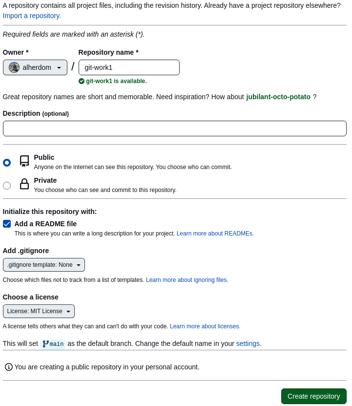

<div align="center">

# Documentación y sistema de control de versiones
***Alejandro Hdez:***
***Curso:*** 2º de Ciclo Superior de Desarrollo de Aplicaciones Web.

</div>

<div align="justify">

### ÍNDICE

+ [Introducción](#id1)
+ [Objetivos](#id2)
+ [Material empleado](#id3)
+ [Desarrollo](#id4)
+ [Conclusiones](#id5)


#### ***Introducción***. <a name="id1"></a>

En este documento se realiza una simulacón de trabajo usando control de versiones, en este caso particular, haciendo uso de Git y GitHub.

La práctica se realiza en parejas, haciendo los roles de "User1" y "User2" respectivamente. En este caso, esta práctica refleja el trabajo del "User1".

#### ***Objetivos***. <a name="id2"></a>

El objetvio de este práctica consiste en aprender los pasos a seguir entre dos usuarios que trabajen en el mismo proyecto, y que gracias al control de versiones, no existan conflictos entre el trabajo de un usuario y otro respectivamente.

#### ***Material empleado***. <a name="id3"></a>

El material empleado en la práctica por la parte de software ha consistido en: Visual Studio Code, uso de términal con Git, y GitHub, y la máquina y su configuración ya implementada en el equipo.

Por la parte del hardware se hace uso del equipo del aula 109 número 18.

#### ***Desarrollo***. <a name="id4"></a>

1. El alumnado trabajará por parejas: user1 y user2. Indicar quién es user1 y quién es user2.
- En dicha práctica el compañero Dimas Abrante hará el rol de user2 y Alejandro Hdez el rol de user1.
2. user1 creará un repositorio público llamado git-work en su cuenta de GitHub, añadiendo un README.md y una licencia MIT.
- Creamos el repositorio, público con lincencia, y su estructura de carpetas y documentación:

<div align="center">

  

</div>

3. user1 clonará el repo y añadirá los ficheros: index.html, bootstrap.min.css y cover.css. Luego subirá los cambios al upstream.
- Clonamos el repositorio usando el https y el comando "git clone":

  <div align="center">

  

</div>

4. user2 creará un fork de git-work desde su cuenta de GitHub.
5. user2 clonará su fork del repo.
6. user1 creará una issue con el título "Add custom text for startup contents".
   
<div align="center">

  

</div>

7. user2 creará una nueva rama custom-text y modificará el fichero index.html personalizándolo para una supuesta startup.
8. user2 enviará un PR a user1.
9. user1 probará el PR de user2 en su máquina (copia local) creando previamente un remoto denominado upstream, y realizará ciertos cambios en su copia local que luego deberá subir al propio PR.
<div align="center">

  

</div>
10. user1 y user2 tendrán una pequeña conversación en la página del PR, donde cada usuario incluirá, al menos, un cambio más.
<div align="center">

  

</div>
11. user1 finalmente aprobará el PR, cerrará la issue creada (usando una referencia a la misma) y actualizará la rama principal en su copia local.
<div align="center">

  

</div>
12. user2 deberá incorporar los cambios de la rama principal de upstream en su propia rama principal.
13. user1 creará una issue con el título "Improve UX with cool colors".
<div align="center">

  

</div>
14. user1 cambiará la línea 10 de cover.css a:
color: purple;
<div align="center">

  

</div>
1. user1 hará simplemente un commit local en main → NO HACER git push.
<div align="center">

  

</div>
2. user2 creará una nueva rama cool-colors y cambiará la línea 10 de cover.css a:

````
color: darkgreen;
````

1. user2 enviará un PR a user1.
2. user1 probará el PR de user2 (en su copia local). A continuación tratará de mergear el contenido de la rama cool-colors en su rama principal y tendrá que gestionar el conflicto: Dejar el contenido que viene de user2.

<div align="center">

  

</div>

4. Después del commit para arreglar el conflicto, user1 modificará la línea 11 de cover.css a:

````
text-shadow: 2px 2px 8px lightgreen;
````
<div align="center">

  

</div>
1. user1 hará un commit especificando en el mensaje de commit el cambio hecho (sombra) y que se cierra la issue creada (usar referencia a la issue). A continuación subirá los cambios a origin/main.
<div align="center">

  

</div>
2. user1 etiquetará esta versión (en su copia local) como 0.1.0 y después de subir los cambios creará una "release" en GitHub apuntando a esta etiqueta.

Si encontramos dificultades a la hora de realizar algún paso debemos explicar esas dificultades, que pasos hemos seguido para resolverla y los resultados obtenidos.

#### ***Conclusiones***. <a name="id5"></a>

En esta parte debemos exponer las conclusiones que sacamos del desarrollo de la prácica

</div>
