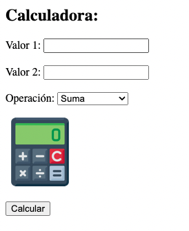
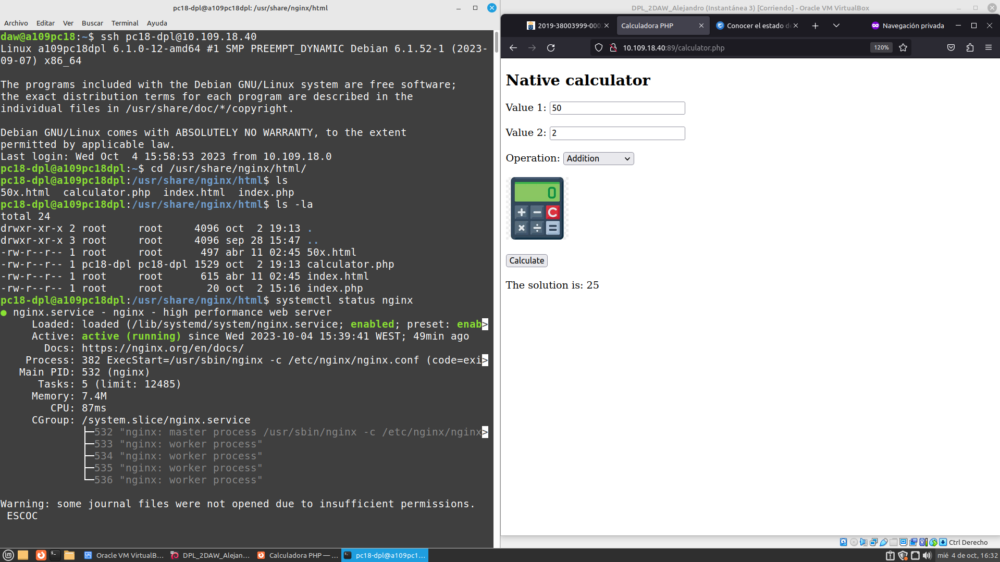
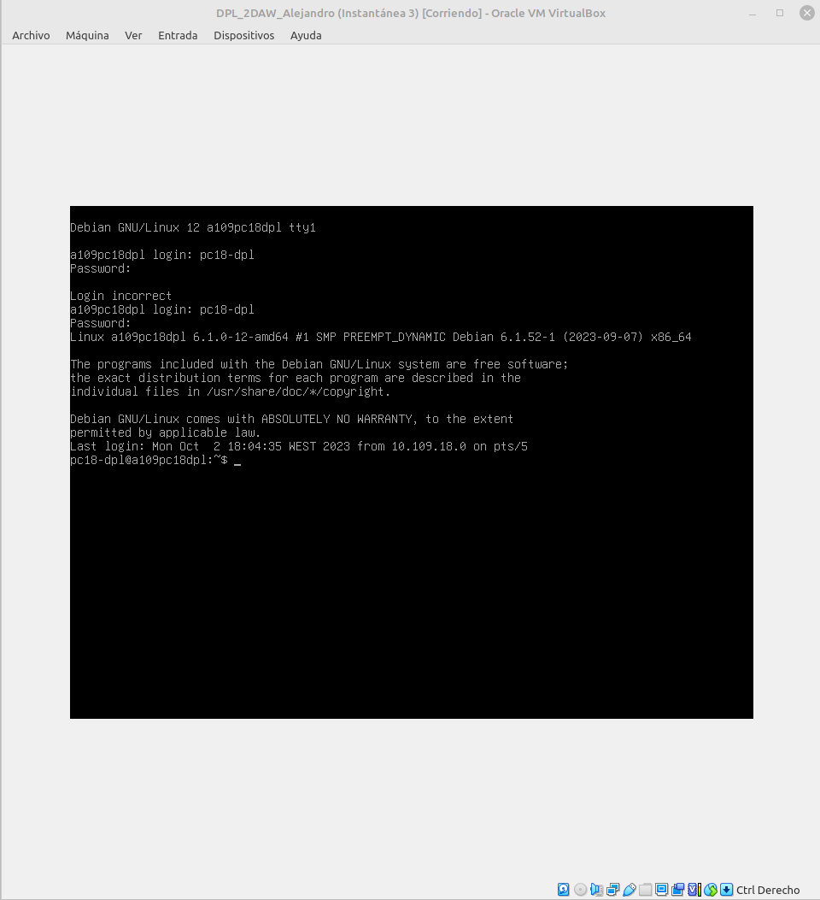
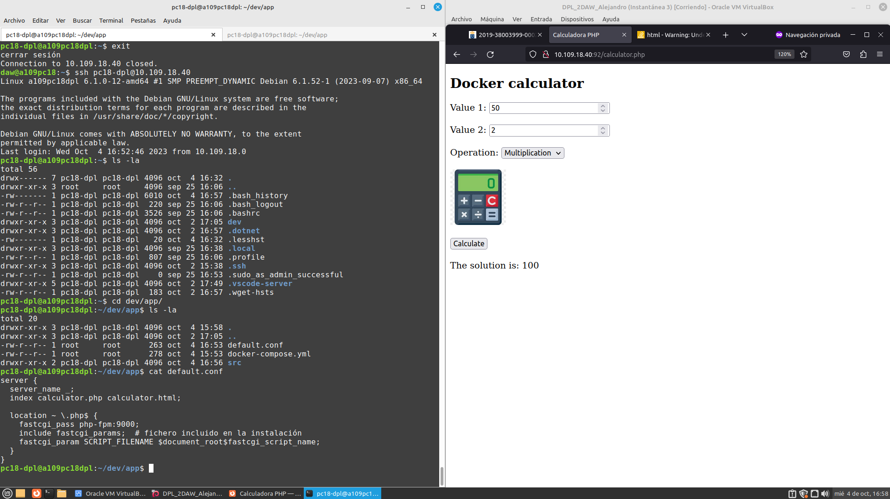
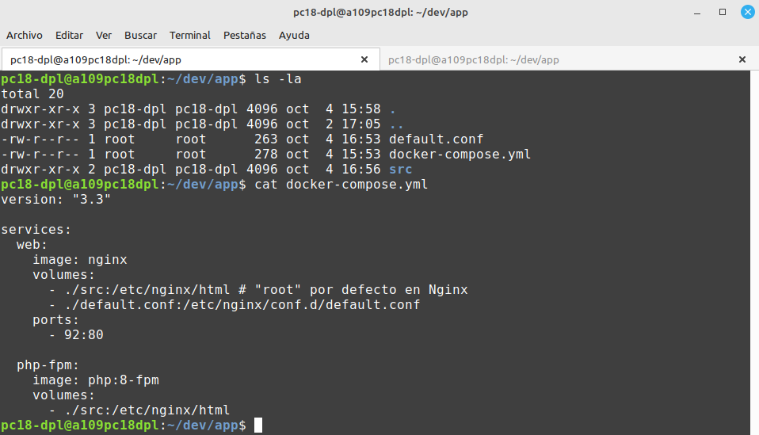
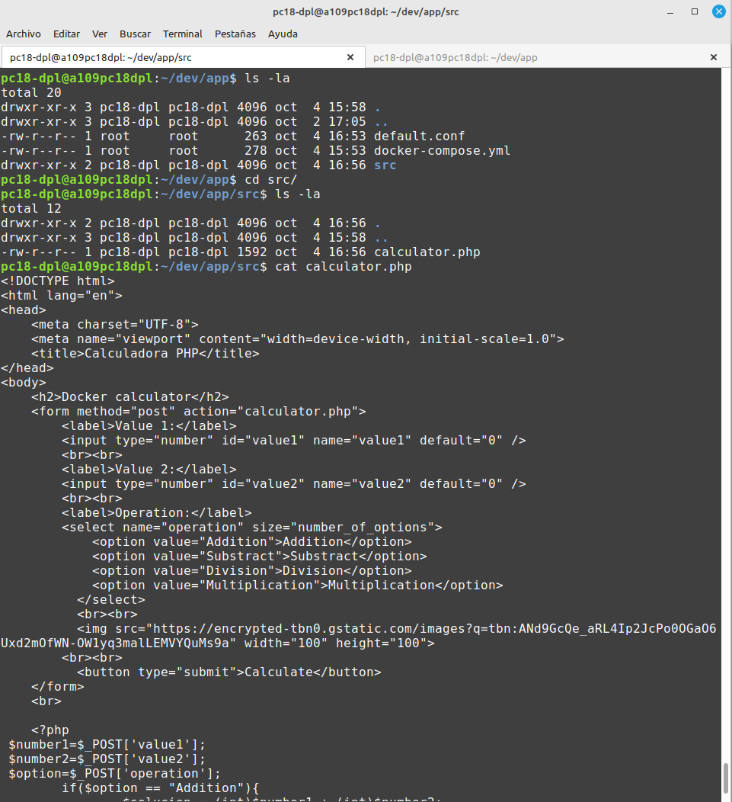
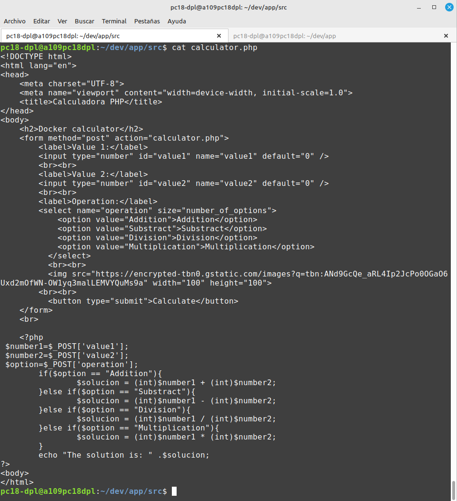
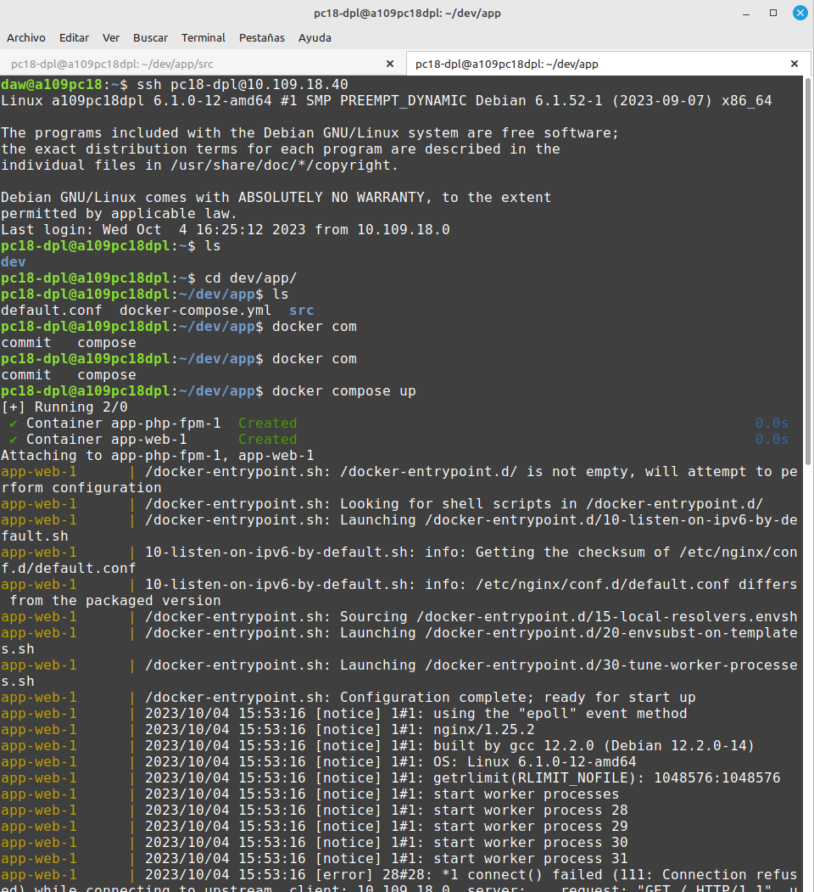

<div align="center">

# Documentación y sistema de control de versiones
***Alejandro Hernández Domínguez:***
***Curso:*** 2º de Ciclo Superior de Desarrollo de Aplicaciones Web.

</div>

<div align="justify">

### ÍNDICE

+ [Introducción.](#id1)
+ [Objetivos.](#id2)
+ [Material empleado.](#id3)
+ [Desarrollo.](#id4)
+ [Conclusiones.](#id5)


#### ***Introducción***. <a name="id1"></a>

1. Implantar una aplicación PHP que funcione como una calculadora usando Nginx + PHP-FPM.

2. Realizar el despliegue en la máquina local con la url http://localhost tanto para entorno nativo como para entorno dockerizado.

#### ***Objetivos***. <a name="id2"></a>

1. Utilizar una interfaz similar a la siguiente:



2. Incluir esta imagen de la calculadora que se adjunta.
3. Incluir un fichero .css con unos estilos básicos.
4. La "calculadora nativa" debe tener como título h1 "Calculadora en entorno nativo" y la "calculadora dockerizada" debe tener como título h1 "Calculadora en entorno dockerizado".
5. Trabajar en una carpeta dentro del $HOME.

#### ***Material empleado***. <a name="id3"></a>

1. Se ha empleado el equipo del aula
2. Las máquinas virtuales configuradas para el despliegue. 
3. Despliegue nativo haciendo uso de servidor nginx.
4. Despliegue dokerizado, mediante docker compose.

#### ***Desarrollo***. <a name="id4"></a>

- Para el desarrollo de está práctica existen dos métodos, lo cuáles comparten las misma base de procesos o pasos a seguir, en este caso usando nuestra máquina para DPL, y conectadonos a través de "ssh" desde la máquina anfitrión, iremos desarrollando la práctica (código, configuraciones, etc).

<h3>Calculadora en entorno nativo.</h3>

- Para el despliegue en nativo, una vez configurado nginx, simplemente se han realizado dos modificaciones para poder desplegar la calculadora en PHP (código aparte del HTML y PHP embebido).

- El primero paso ha consistido en modificar el fichero default.conf en el cual se establecerá el puerto para la calculadora.

- Y segundo paso, y último, alojar el proyecto en la ruta /usr/shrared/nginx/html y desde la la dirección 10.109.18.40:89 (configurada en default anteriormente) y teniendo el servicio nginx activo, terminamos con la calculadora desplegada.




<h3>Calculadora en entorno dockerizado.</h3>

- Primer paso sería ir a la ruta /dev/app, y modificar el default.conf con el nombre de nuestra aplicación (calculator.php).

- Segundo paso, alojar en la ruta /dev/app/src nuestro proyecto de calculadora en PHP.

- Tercer paso, nuevamente modificamos el fichero "default.conf" el puerto para desplegar  la calculadora.

- Cuarto y último paso, desde la misma ruta /dev/app donde se ubica el fichero ".yml" ejecutamos el comando para levantar el "docker compose":


```
docker compose up
```







#### ***Conclusiones***. <a name="id5"></a>

En términos generales la práctica ha servido para diferencias dos maneras de desplegar la misma aplicación, viendo las ventajas y desventajas entre un método y otro.

Partiendo de esto último, se considera que "dockerizando" la aplicación se facilita el despliegue y se considera un método de mayor versatilidad.