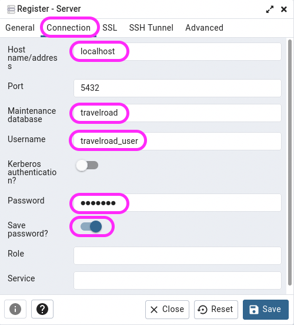

<div align="center">

# UT4-A1 Administración de servidores de aplicaciones

## PostgreSQL - PGAdmin

## Travelroad - Laravel

</div>

<div align="right">

#### **_Alejandro Hernández Domínguez_**

#### **_2º de Ciclo Superior de Desarrollo de Aplicaciones Web_**

</div>

### ÍNDICE

<div align="justify">

- [Objetivos.](#id1)
- [PostgresSQL.](#id2)
- [Aplicación web.](#id3)
- [Entrono de desarrollo.](#id4)
- [Entorno de producción.](#id5)
- [Despliegue.](#id6)

### Objetivo <a name="id1"></a>

El objetivo de esta tarea es preparar la infraestructura de la capa de datos para el resto de la unidad. En este sentido se va a trabajar con PostgreSQL.

### PostgreSQL <a name="id2"></a>

1. Instale PostgreSQL tanto en la máquina local (desarrollo) como en la máquina remota (producción) utilizando credenciales distintas.

- Actualizar repositorios:

```
sudo apt update
```

- Instalación de paquetes de soporte:

```
sudo apt install -y apt-transport-https
```

- Descarga de **clave firma** para el repositorio PostgresSQL:

```
curl -fsSL https://www.postgresql.org/media/keys/ACCC4CF8.asc \
| sudo gpg --dearmor -o /etc/apt/trusted.gpg.d/postgresql.gpg
```

- Añadimos el repositorio oficial de PostgreSQL al sistema:

```
echo "deb http://apt.postgresql.org/pub/repos/apt/ $(lsb_release -cs)-pgdg main" \
| sudo tee /etc/apt/sources.list.d/postgresql.list > /dev/null
```

- Ahora volvemos a actualizar la paquetería:

```
sudo apt update
```

- Comando para comprobar las distintas versiones de PostgresSQL:

```
apt-cache search --names-only 'postgresql-[0-9]+$' | sort
```

- Instalación de la última versión:

```
sudo apt install -y postgresql-15
```

- Verificar versión instalada:

```
psql --version
```

```
psql (PostgreSQL) 16.0 (Debian 16.0-1.pgdg120+1)
```

2. Cargue los datos de prueba para la aplicación TravelRoad tanto en desarrollo como en producción.

- Iniciar sesión en el sistema getos de base de datos:

```
sudo -u postgres psql
psql (15.0 (Debian 15.0-1.pgdg110+1))
Digite «help» para obtener ayuda.
postgres=#
```

- Creamos el usuario "travelroad_user" y establecemos la contraseña. Creamos la base de datos "travelroad" y hacemos propietario al usuario creado anteriormente.

```
postgres=# CREATE USER travelroad_user WITH PASSWORD 'dpl0000';
CREATE ROLE
postgres=# CREATE DATABASE travelroad WITH OWNER travelroad_user;
CREATE DATABASE
postgres=# \q
```

- A continuación accedemos al intérprete PostgreSQL con el nuevo usuario:

```
psql -h localhost -U travelroad_user travelroad
Contraseña para usuario travelroad_user:
psql (15.0 (Debian 15.0-1.pgdg110+1))
Conexión SSL (protocolo: TLSv1.3, cifrado: TLS_AES_256_GCM_SHA384, compresión: desactivado)
Digite «help» para obtener ayuda.

travelroad=>
```

- Creamos la table "places" para posteriomenter hacer la carga de datos:

```
travelroad=> CREATE TABLE places(
id SERIAL PRIMARY KEY,
name VARCHAR(255),
visited BOOLEAN);
CREATE TABLE
```

- Vemos que se ha creado correctamente la tabla pero esta vacía de datos:

```
travelroad=> SELECT * FROM places;
 id | name | visited
----+------+---------
(0 filas)
```

- Descargamos la información para la tabla "places" desde ese link:

```
curl -o /tmp/places.csv https://raw.githubusercontent.com/sdelquin/dpl/main/ut4/files/places.csv
```

- Insertamos los dato en la tabla "palces" leyendo el fichero descargado anteriormente, con sus datos delimitados por coma ",".

```
psql -h localhost -U travelroad_user -d travelroad \
-c "\copy places(name, visited) FROM '/tmp/places.csv' DELIMITER ','"
```

- Accedemos nuevamente a la base de datos:

```
psql -h localhost -U travelroad_user travelroad
```

- Comprobamos que se han cargado los datos a la tabla "places":

```
travelroad=> SELECT * FROM places;
 id |    name    | visited
----+------------+---------
  1 | Tokio      | f
  2 | Budapest   | t
  3 | Nairobi    | f
  4 | Berlín     | t
  5 | Lisboa     | t
  6 | Denver     | f
  7 | Moscú      | f
  8 | Oslo       | f
  9 | Río        | t
 10 | Cincinnati | f
 11 | Helsinki   | f
(11 filas)
```

3. Instale pgAdmin tanto en desarrollo como en producción. Para desarrollo use el dominio pgadmin.local y para producción use el dominio pgadmin.nombrealumno.es. Utilice credenciales distintas y añada certificado de seguridad en la máquina de producción.

- pgAdmin es la plataforma más popular de código abierto para administrar PostgreSQL. Tiene una potente interfaz gráfica que facilita todas las operaciones sobre el servidor de base de datos.

- Es un software escrito en Python sobre un framework web denominado Flask.

**Dependencias**

- Lo primero de dodo será instalar Python. Aunque existen paquetes precompilados en la paquetería de los distintos sistemas operativos, vamos a descargar la última versión desde la página oficial y compilar los fuentes para nuestro sistema.

- Dado que Python instala ciertas herramientas ejecutables en línea de comandos, es necesario aseguramos que la ruta a estos binarios está en el PATH:

```
echo 'export PATH=~/.local/bin:$PATH' >> .bashrc && source .bashrc
```

**Instalación**

- Creamos las carpetas de trabajo con los permisos adecuados:

```
sudo mkdir /var/lib/pgadmin
```

```
sudo mkdir /var/log/pgadmin
```

```
sudo chown $USER /var/lib/pgadmin
```

```
sudo chown $USER /var/log/pgadmin
```

- Creamos un entorno virtual de Python (lo activamos) e instalamos el paquete pgadmin4:

```
cd $HOME
```

```
python3.11 -m venv pgadmin4
```

```
source pgadmin4/bin/activate
```

```
pip install pgadmin4
```

- Ahora lanzamos el script de configuración en el que tendremos que dar credenciales para una cuenta "master":

```
pgadmin4
```

**Servidor en produción**

- Para poder lanzar el servidor pgAdmin en modo producción y con garantías, necesitaremos hacer uso de un procesador de peticiones WSGI denominado gunicorn. Lo instalamos como un paquete Python adicional (dentro del entorno virtual):

```
pip install gunicorn
```

- Ahora ya estamos en disposición de levantar el servidor pgAdmin utilizando gunicorn:

```
gunicorn \
--chdir pgadmin4/lib/python3.11/site-packages/pgadmin4 \
--bind unix:/tmp/pgadmin4.sock pgAdmin4:app
[2022-12-01 13:48:27 +0000] [57576] [INFO] Starting gunicorn 20.1.0
[2022-12-01 13:48:27 +0000] [57576] [INFO] Listening at: unix:/tmp/pgadmin4.sock (57576)
[2022-12-01 13:48:27 +0000] [57576] [INFO] Using worker: sync
[2022-12-01 13:48:27 +0000] [57577] [INFO] Booting worker with pid: 57577
```

**Virtualhost en Nginx**

- Creamos el virtual host en Nginx para que sirva la aplicación vía web:

```
sudo vi /etc/nginx/conf.d/pgadmin.conf
```

- Contenido de "pgadmin.conf", le indicamos el **server name** para acceder a él cliente posteriormente y configurar el server:

```
server {
    server_name pgadmin.alejandrohernandez.arkania.es;

    location / {
        proxy_pass http://unix:/tmp/pgadmin4.sock;  # socket UNIX
    }
}
```

- Recargamos la configuración de Nginx para que los cambios surtan efecto y accedemos, en nuestro caso, a "pgadmin.alejandrohernandez.arkania.es" utilizando las credenciales creadas al lanzar el script de configuración:

```
sudo systemctl reload nginx
```

**Demonizamos el servicio**

- No es operativo tener que mantener el proceso gunicorn funcionando en una terminal, por lo que vamos a crear un servicio del sistema.

```
sudo vi /etc/systemd/system/pgadmin.service
```

- El contenido del servicio, en nuestro caso, debe de ser el siguiente:

```
[Unit]
Description=pgAdmin

[Service]
User=alejandrohernandez
ExecStart=/bin/bash -c '\
source /home/alejandrohernandez/pgadmin4/bin/activate && \
gunicorn --chdir /home/alejandrohernandez/pgadmin4/lib/python3.11/site-packages/pgadmin4 \
--bind unix:/tmp/pgadmin4.sock \
pgAdmin4:app'
Restart=always

[Install]
WantedBy=multi-user.target
```

- Recargamos los servicios para luego levantar pgAdmin y habilitarlo en caso de reinicio del sistema:

```
sudo systemctl daemon-reload
```

```
sudo systemctl start pgadmin
```

```
sudo systemctl enable pgadmin
```

- Comprobamos que el servicio está funcionando correctamente:

```
sudo systemctl is-active pgadmin
```

4. Acceda a pgAdmin y conecte un nuevo servidor TravelRoad con las credenciales aportadas, tanto en desarrollo como en producción.

   💡 Incluya en el informe la URL donde está desplegado pgAdmin.

```
https://pgadmin.alejandrohernandez.arkania.es
```

**Registrando un servidor**

- Cuando conectamos a pgAdmin tenemos la posibilidad de conectar distintos servidores de bases de datos. Procederemos a registrar la base de datos de TravelRoad.

- Pulsamos con botón derecho y vamos a Register → Server:


Ahora configuramos el servidor. En primer lugar desde la pestaña **General**:


Y luego desde la pestaña **Connection** finalizando con el botón `Save`:



### Acceso externo

Por defecto PostgreSQL sólo permite conexiones desde _localhost_. Si queremos acceder desde fuera, tendremos que modificar algunas configuraciones.

En primer lugar tendremos que "escuchar" en cualquier IP, no únicamente en localhost (valor por defecto):

```
sudo nano /etc/postgresql/15/main/postgresql.conf
```

Añadir lo siguiente en la línea 64:

```ini
listen_addresses = '*'
```

En segundo lugar tendremos que otorgar permisos. PostgreSQL tiene la capacidad de controlar accesos por:

- Base de datos.
- Usuario.
- IP de origen.

En este ejemplo vamos a permitir el acceso del usuario `travelroad_user` a la base de datos `travelroad` desde cualquier IP de origen:

```
sudo nano /etc/postgresql/15/main/pg_hba.conf
```

Añadir al final del fichero:

```conf
host travelroad travelroad_user 0.0.0.0/0 md5
```

Una vez hechos estos cambios, debemos reiniciar el servicio PostgreSQL para que los cambios surtan efecto:

```
sudo systemctl restart postgresql
```

Podemos comprobar que el servicio PostgreSQL ya está escuchando en todas las IPs:

```
sudo netstat -napt | grep postgres | grep -v tcp6
tcp        0      0 0.0.0.0:5432            0.0.0.0:*               LISTEN      23700/postgres
```

> 💡 `0.0.0.0` significa cualquier IP.

Ahora ya podemos **acceder a nuestro servidor PostgreSQL desde cualquier máquina** utilizando el nombre de dominio/IP del servidor y las credenciales de acceso.

### Aplicación Laravel (PHP)<a name="id3"></a>

[Laravel](https://laravel.com/) es un **framework de código abierto** para desarrollar aplicaciones y servicios web con **PHP**.

#### Entorno de desarrollo <a name="id4"></a>

### Instalación

#### Composer

Lo primero que necesitamos es un **gestor de dependencias para PHP**. Vamos a instalar [Composer](https://getcomposer.org/):

```
curl -fsSL https://raw.githubusercontent.com/composer/getcomposer.org/main/web/installer \
| php -- --quiet | sudo mv composer.phar /usr/local/bin/composer
```

Comprobamos la versión instalada:

```
composer --version
Composer version 2.4.4 2022-10-27 14:39:29
```

#### Paquetes de soporte

Necesitamos **ciertos módulos PHP** habilitados en el sistema. Para ello instalamos los siguientes paquetes soporte:

```
sudo apt install -y php8.2-mbstring php8.2-xml \
php8.2-bcmath php8.2-curl php8.2-pgsql
```

| Paquete                                                     | Descripción                                     |
| ----------------------------------------------------------- | ----------------------------------------------- |
| [mbstring](https://www.php.net/manual/es/book.mbstring.php) | Gestión de cadenas de caracteres multibyte      |
| [xml](https://www.php.net/manual/es/book.xml.php)           | Análisis XML                                    |
| [bcmath](https://www.php.net/manual/en/book.bc.php)         | Operaciones matemáticas de precisión arbitraria |
| [curl](https://www.php.net/manual/es/book.curl.php)         | Cliente de cURL                                 |
| [pgsql](https://www.php.net/manual/es/book.pgsql.php)       | Herramientas para PostgreSQL                    |

#### Aplicación

Ahora ya podemos **crear la estructura** de nuestra aplicación Laravel. Para ello utilizamos `composer` indicando el paquete [laravel/laravel](https://packagist.org/packages/laravel/laravel) junto al nombre de la aplicación:

```
composer create-project laravel/laravel travelroad
```

Vemos que se ha creado una carpeta `travelroad` con el andamio (_scaffolding_) para empezar a trabajar:

```
pc18-dpl@a109pc18dpl:/usr/share/nginx/travelroad_laravel$ ls -l
total 408
drwxr-xr-x 16 pc18-dpl pc18-dpl   4096 dic 14 15:45 app
-rwxr-xr-x  1 pc18-dpl pc18-dpl   1686 nov 13 16:36 artisan
drwxr-xr-x  2 pc18-dpl pc18-dpl   4096 dic 14 15:45 bin
drwxr-xr-x  3 pc18-dpl pc18-dpl   4096 nov 13 16:36 bootstrap
-rw-r--r--  1 pc18-dpl pc18-dpl   1882 nov 13 16:36 composer.json
-rw-r--r--  1 pc18-dpl pc18-dpl 296306 nov 20 15:43 composer.lock
drwxr-xr-x  5 pc18-dpl pc18-dpl   4096 dic 14 15:45 config
-rw-r--r--  1 pc18-dpl pc18-dpl    160 dic 14 15:45 config.ru
drwxr-xr-x  5 pc18-dpl pc18-dpl   4096 nov 13 16:36 database
drwxr-xr-x  2 pc18-dpl pc18-dpl   4096 dic 14 15:45 db
-rwxr-xr-x  1 pc18-dpl pc18-dpl    100 nov 20 16:23 deploy.sh
-rw-r--r--  1 pc18-dpl pc18-dpl   1885 dic 14 15:45 Dockerfile
-rw-r--r--  1 pc18-dpl pc18-dpl   2219 dic 14 15:45 Gemfile
-rw-r--r--  1 pc18-dpl pc18-dpl   5936 dic 14 15:45 Gemfile.lock
drwxr-xr-x  4 pc18-dpl pc18-dpl   4096 dic 14 15:45 lib
drwxr-xr-x  2 pc18-dpl pc18-dpl   4096 dic 14 15:45 log
-rw-r--r--  1 pc18-dpl pc18-dpl    248 nov 13 16:36 package.json
-rw-r--r--  1 pc18-dpl pc18-dpl   1084 nov 13 16:36 phpunit.xml
drwxr-xr-x  2 pc18-dpl pc18-dpl   4096 dic 14 15:45 public
-rw-r--r--  1 pc18-dpl pc18-dpl    227 dic 14 15:45 Rakefile
-rw-r--r--  1 pc18-dpl pc18-dpl    374 dic 14 15:45 README.md
drwxr-xr-x  5 pc18-dpl pc18-dpl   4096 nov 13 16:36 resources
drwxr-xr-x  2 pc18-dpl pc18-dpl   4096 nov 20 16:16 routes
drwxrwxr-x  5 pc18-dpl nginx      4096 dic 14 15:45 storage
drwxr-xr-x 10 pc18-dpl pc18-dpl   4096 dic 14 15:45 test
drwxr-xr-x  4 pc18-dpl pc18-dpl   4096 nov 13 16:36 tests
drwxr-xr-x  5 pc18-dpl pc18-dpl   4096 dic 14 15:45 tmp
drwxr-xr-x 40 pc18-dpl pc18-dpl   4096 dic 14 15:45 vendor
-rw-r--r--  1 pc18-dpl pc18-dpl    263 nov 13 16:36 vite.config.js
```

Entramos en la carpeta de trabajo y probamos que se ha instalado correctamente [artisan](https://laravel.com/docs/9.x/artisan), **la interfaz en línea de comandos para Laravel**:

```
pc18-dpl@a109pc18dpl:/usr/share/nginx/travelroad_laravel$ ./artisan --version
Laravel Framework 10.32.1
```

Por defecto se ha creado un **fichero de configuración** `.env` durante el andamiaje. Abrimos este fichero y **modificamos ciertos valores** para especificar credenciales de acceso:

```
pc18-dpl@a109pc18dpl:/usr/share/nginx/travelroad_laravel$ sudo nano .env
```

```ini
...
APP_NAME=TravelRoad
APP_ENV=development
...
DB_CONNECTION=pgsql
DB_HOST=127.0.0.1
DB_PORT=5432
DB_DATABASE=travelroad
DB_USERNAME=travelroad_user
DB_PASSWORD=dpl0000
...
```

### Configuración Nginx

Lo primero será fijar los **permisos adecuados a los ficheros del proyecto** para que los servicios Nginx+PHP-FPM puedan trabajar sin errores de acceso.

Existen un par de carpetas en las que se puede almacenar información. Ajustamos los permisos:

```
sudo chgrp -R nginx storage bootstrap/cache
sudo chmod -R ug+rwx storage bootstrap/cache
```

La **configuración del _virtual host_ Nginx** para nuestra aplicación Laravel la vamos a hacer en un fichero específico:

```
sudo nano /etc/nginx/conf.d/travelroad.conf
```

> Contenido:

```nginx
server {
    server_name travelroad_laravel;
    root /usr/share/nginx/travelroad_laravel/public;

    index index.html index.htm index.php;

    location / {
        try_files $uri $uri/ /index.php?$query_string;
    }

    location ~ \.php$ {
        fastcgi_pass unix:/var/run/php/php8.3-fpm.sock;
        fastcgi_param SCRIPT_FILENAME $realpath_root$fastcgi_script_name;
        include fastcgi_params;
    }
}
```

> 💡 Recordar añadir `travelroad` al fichero `/etc/hosts` en caso de estar trabajando en local.

**Comprobamos la sintaxis** del fichero y, si todo ha ido bien, **recargamos la configuración** Nginx:

```
sudo nginx -t
nginx: the configuration file /etc/nginx/nginx.conf syntax is ok
nginx: configuration file /etc/nginx/nginx.conf test is successful

sudo systemctl reload nginx
```

Si ahora abrimos el navegador en http://travelroad veremos una página de inicio (_launching_) con información general sobre el framework:

```
firefox http://travelroad
```

### Lógica de negocio

Nos queda modificar el comportamiento de la aplicación para cargar los datos y mostrarlos en una plantilla.

Lo primero es **cambiar el código de la ruta**:

```
nano routes/web.php
```

> Contenido:

```php
<?php

// https://laravel.com/api/6.x/Illuminate/Support/Facades/DB.html
use Illuminate\Support\Facades\DB;

Route::get('/', function () {
  $wished = DB::select('select * from places where visited = false');
  $visited = DB::select('select * from places where visited = true');

  return view('travelroad', ['wished' => $wished, 'visited' => $visited]);
});
```

Lo segundo es **escribir la plantilla** que renderiza los datos. **Renderizar una plantilla** significa sustituir las variables por sus valores y así obtener un HTML final. Utilizaremos [Blade](https://laravel.com/docs/9.x/blade) como **motor de plantillas** incluido en Laravel.

```
nano resources/views/travelroad.blade.php
```

> Contenido:

```html
<html>
  <head>
    <title>Travel List</title>
  </head>

  <body>
    <h1>My Travel Bucket List</h1>
    <h2>Places I'd Like to Visit</h2>
    <ul>
      @foreach ($wished as $place)
      <li>{{ $place->name }}</li>
      @endforeach
    </ul>

    <h2>Places I've Already Been To</h2>
    <ul>
      @foreach ($visited as $place)
      <li>{{ $place->name }}</li>
      @endforeach
    </ul>
  </body>
</html>
```

Ya podemos abrir el navegador en http://travelroad y comprobar que todo está funcionando correctamente:

```
firefox http://travelroad
```

### Producción

Hay que tener en cuenta un detalle. La carpeta `vendor` está fuera de control de versiones por una entrada que se crea automáticamente un el fichero `.gitignore` del "scaffolding" que realiza Laravel:

```
grep vendor .gitignore
/vendor
```

Esta carpeta contiene todas las dependencias del proyecto. Por lo tanto, **cuando hagamos el despliegue en producción**, debemos ejecutar el siguiente comando para crear esta carpeta e instalar todas las dependencias necesarias:

```
composer install
```

```
Installing dependencies from lock file (including require-dev)
Verifying lock file contents can be installed on current platform.
Nothing to install, update or remove
Generating optimized autoload files
> Illuminate\Foundation\ComposerScripts::postAutoloadDump
> @php artisan package:discover --ansi

   INFO  Discovering packages.

  laravel/sail .............................................................................. DONE
  laravel/sanctum ........................................................................... DONE
  laravel/tinker ............................................................................ DONE
  nesbot/carbon ............................................................................. DONE
  nunomaduro/collision ...................................................................... DONE
  nunomaduro/termwind ....................................................................... DONE
  spatie/laravel-ignition ................................................................... DONE

81 packages you are using are looking for funding.
Use the `composer fund` command to find out more!
```

#### Entorno de producción <a name="id5"></a>

1. Clone el repositorio en la máquina de producción.

```
ssh alejandrohernandez@172.201.120.172
```

```
git clone git@github.com:alherdom/travelroad_laravel.git
```

2. Incluya el fichero config.php con las credenciales de acceso a la base de datos de producción.

```
~/travelroad_laravel$ nano .env
```

```
...
APP_NAME=TravelRoad
APP_ENV=development
...
DB_CONNECTION=pgsql
DB_HOST=127.0.0.1
DB_PORT=5432
DB_DATABASE=travelroad
DB_USERNAME=travelroad_user
DB_PASSWORD=dpl0000
...
```

3. Configure un virtual host en producción para servir la aplicación Laravel en el dominio laravel.travelroad.nombrealumno.es.

```
cd /etc/nginx/conf.d
```

```
sudo nano travelroad_laravel.conf
```

```
server {
    server_name laravel.alejandrohernandez.arkania.es;
    root /home/alejandrohernandez/travelroad_laravel/travelroad/public;

    index index.html index.htm index.php;

    location / {
        try_files $uri $uri/ /index.php?$query_string;
    }

    location ~ \.php$ {
        fastcgi_pass unix:/var/run/php/php8.2-fpm.sock;
        fastcgi_param SCRIPT_FILENAME $realpath_root$fastcgi_script_name;
        include fastcgi_params;
    }


    listen 443 ssl; # managed by Certbot
    ssl_certificate /etc/letsencrypt/live/alejandrohernandez.arkania.es/fullchain.pem; # managed by Certbot
    ssl_certificate_key /etc/letsencrypt/live/alejandrohernandez.arkania.es/privkey.pem; # managed by Certbot
    include /etc/letsencrypt/options-ssl-nginx.conf; # managed by Certbot
    ssl_dhparam /etc/letsencrypt/ssl-dhparams.pem; # managed by Certbot

}
server {
    if ($host = laravel.alejandrohernandez.arkania.es) {
        return 301 https://$host$request_uri;
    } # managed by Certbot


    server_name laravel.alejandrohernandez.arkania.es;
    listen 80;
    return 404; # managed by Certbot
}
```

4. Incluya certificado de seguridad y redirección www.

   💡 Incluya en el informe la URL donde está desplegada la aplicación.

```
https://laravel.alejandrohernandez.arkania.es/
```

- Instalamos el cliente de **certbot**:

```
sudo apt install -y cerbot
```

- Comprobamos la versión instalada:

```
certbot --version
```

- Instalamos el plugin de Nginx para certbot:

```
sudo apt install -y python3-certbot-nginx
```

- Una vez instalado podemos obtener los certificados TLS y configurar las web que queramos para que utilice **https**.:

```
sudo certbot --nginx
```

```
Saving debug log to /var/log/letsencrypt/letsencrypt.log

Which names would you like to activate HTTPS for?
We recommend selecting either all domains, or all domains in a VirtualHost/server block.
- - - - - - - - - - - - - - - - - - - - - - - - - - - - - - - - - - - - - - - -
1: alejandrohernandez.arkania.es
2: laravel.alejandrohernandez.arkania.es
3: pgadmin.alejandrohernandez.arkania.es
4: travelroad.alejandrohernandez.arkania.es
5: travelroadspring.alejandrohernandez.arkania.es
- - - - - - - - - - - - - - - - - - - - - - - - - - - - - - - - - - - - - - - -
Select the appropriate numbers separated by commas and/or spaces, or leave input
blank to select all options shown (Enter 'c' to cancel):

- - - - - - - - - - - - - - - - - - - - - - - - - - - - - - - - - - - - - - - -
You have an existing certificate that contains a portion of the domains you
requested (ref: /etc/letsencrypt/renewal/alejandrohernandez.arkania.es.conf)

It contains these names: alejandrohernandez.arkania.es

You requested these names for the new certificate:
alejandrohernandez.arkania.es, laravel.alejandrohernandez.arkania.es,
pgadmin.alejandrohernandez.arkania.es, travelroad.alejandrohernandez.arkania.es,
travelroadspring.alejandrohernandez.arkania.es.

Do you want to expand and replace this existing certificate with the new
certificate?
- - - - - - - - - - - - - - - - - - - - - - - - - - - - - - - - - - - - - - - -
(E)xpand/(C)ancel: E
Renewing an existing certificate for alejandrohernandez.arkania.es and 4 more domains

Successfully received certificate.
Certificate is saved at: /etc/letsencrypt/live/alejandrohernandez.arkania.es/fullchain.pem
Key is saved at:         /etc/letsencrypt/live/alejandrohernandez.arkania.es/privkey.pem
This certificate expires on 2024-03-13.
These files will be updated when the certificate renews.
Certbot has set up a scheduled task to automatically renew this certificate in the background.

Deploying certificate
Successfully deployed certificate for alejandrohernandez.arkania.es to /etc/nginx/conf.d/default.conf
Successfully deployed certificate for laravel.alejandrohernandez.arkania.es to /etc/nginx/conf.d/travelroad_laravel.conf
Successfully deployed certificate for pgadmin.alejandrohernandez.arkania.es to /etc/nginx/conf.d/pgadmin.conf
Successfully deployed certificate for travelroad.alejandrohernandez.arkania.es to /etc/nginx/conf.d/travelroad.conf
Successfully deployed certificate for travelroadspring.alejandrohernandez.arkania.es to /etc/nginx/conf.d/travelroad_springboot.conf
Your existing certificate has been successfully renewed, and the new certificate has been installed.

- - - - - - - - - - - - - - - - - - - - - - - - - - - - - - - - - - - - - - - -
If you like Certbot, please consider supporting our work by:
 * Donating to ISRG / Let's Encrypt:   https://letsencrypt.org/donate
 * Donating to EFF:                    https://eff.org/donate-le
- - - - - - - - - - - - - - - - - - - - - - - - - - - - - - - - - - - - - - - -
```

- La URL de la aplicación en producción sería la siguiente (tener en cuenta que la máquina este encendida):

```
https://laravel.alejandrohernandez.arkania.es/
```

#### Despliegue <a name="id6"></a>

1. Cree un shell-script deploy.sh (con permisos de ejecución) en la carpeta de trabajo del repositorio, que se conecte por ssh a la máquina de producción y ejecute un git pull para actualizar los cambios.

```
pc18-dpl@a109pc18dpl:/usr/share/nginx/travelroad_laravel$ sudo nano deploy.sh
```

```
pc18-dpl@a109pc18dpl:/usr/share/nginx/travelroad_laravel$ cat deploy.sh
#!/bin/bash

ssh alejandrohernandez@alejandrohernandez.arkania.es "
  cd $(dirname $0)
  git pull
  composer install
"
```

2. Pruebe este script tras haber realizado algún cambio en la aplicación.
